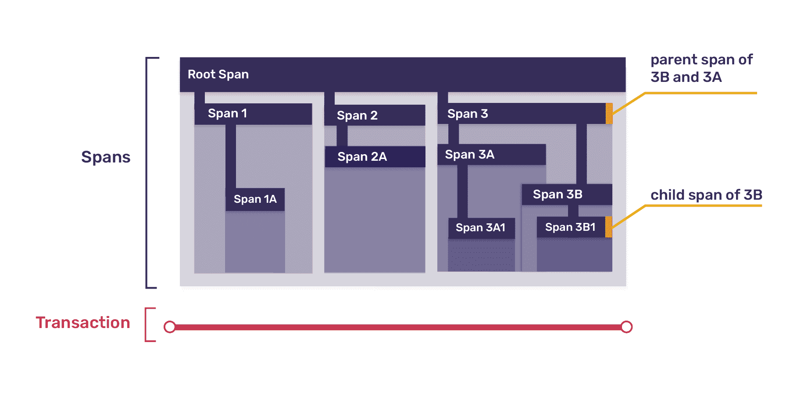
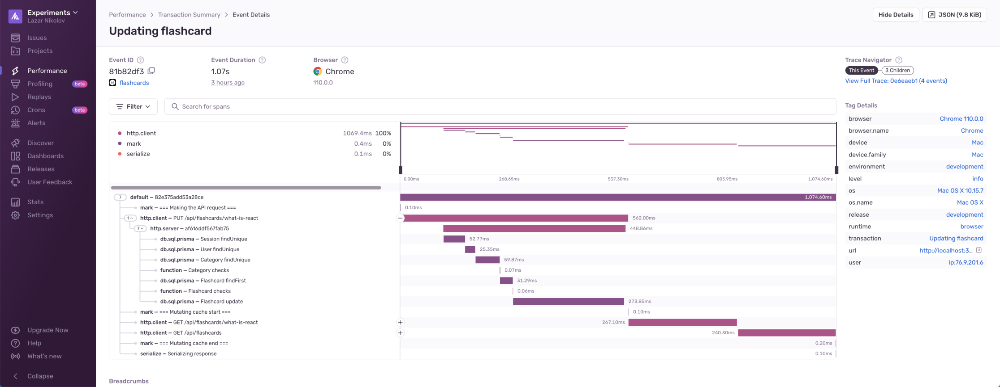

I've been reading about Distributed Tracing lately and I think it's the coolest
way to debug and monitor your apps! Here's what I learned:

Distributed Tracing is the process of tracking the flow and timing of requests
as they pass through a system, which helps us understand the performance of that
system and identify bottlenecks. Simply: it links the operations and requests
occurring between multiple services.


A trace is a log of events that occurred during a program’s execution. It’s a
chain of operations that happened during a certain task. It can be a page load
event started by a browser, or a specific flow that a user is experiencing in
your application, like a checkout flow.

Traces are composed of multiple transactions. For each part in your application
(frontend, backend, database, etc…) a transaction is being created. A
transaction describes the operations that happened within the entity where it’s
created, for example the API handler on the backend. It starts when the HTTP
request reaches the backend, and it ends when we return the HTTP result back to
the client. Each transaction contains at least one span. And what's a span?

Spans are the atomic units of work, like individual resources being loaded, UI
component lifecycle events, file I/O operations, requests made to external
services, etc… Spans that make a request to an external service start another
transaction on that service.



Each span needs to be identified with a span identifier. Done by creating a UUID
when the span begins its operation. The span identifier creation should occur at
every span that takes place within a trace.

So how do we "distribute" the trace? To actually connect separate services, your
application must propagate the trace context. Sentry's trace context contains
the trace ID, the parent span ID, and a sampled value. The format is:

```text
sentry-trace = traceid-spanid-sampled
```

By passing the trace context, our services know which trace they should append
their transaction and child spans to. **This is distributed tracing** ✨

In order to really understand it, I integrated Sentry (sentry.io) in a demo
Next.js app and configured distributed tracing on a single API endpoint. The app
uses Next Auth for auth and Prisma with PlanetScale for a database. Here's the
trace I get for my endpoint:



As you can see, all of the top level spans are coming from the frontend
(http.client). But we have the option to expand the first http.client span and
take a peek at what's happening on the backend while the request is taking
place.

Our db.sql.prisma update span is taking the longest. It runs for about 274ms.
So, if I want to optimize this operation, I know exactly where to look!

Also what's cool is that Sentry automatically configured distributed tracing and
instrumented the Prisma operations for me. I just manually started a custom
transaction that has a custom name in my react hook, but that's automated as
well.

Alright, now let's talk about the benefits!

1. You get to have a clear view of the entire operation flow of a specific
   action, from the frontend/mobile, to the database.
2. Easily identify performance bottlenecks throughout your whole stack.
3. Improve SLO

If you app is built on microservices or serverless, then distributed tracing is
essential. Aside from their advantages, these architectures bring new
challenges, like reduced visibility. Distributed tracing as a tool is the
perfect remedy for that.

Even if your app is not built on microservices or serverless, the benefits of
distributed tracing still matter to you. Every developer wants to identify
performance bottlenecks, regardless of their app's architecture.
