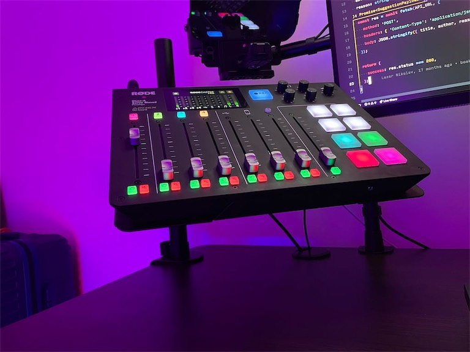

I've been using The
[RØDECaster Pro v1](https://rode.com/en/interfaces-and-mixers/rodecaster-series/rodecaster-pro)
for over a year now. I live streamed on YouTube with it, recorded videos,
screencasts, even gave a few virtual talks with it. It does look really good,
but is worth the investment? It all depends on how you plan on using it. I
personally think I overpaid for its purpose. Here are the pros and cons of the
Rødecaster Pro.

## Pros

This piece of hardware has a decent level of quality. It's not a toy. It's a
professional tool with lots of features that does its job perfectly. Let's see
some of its pros:

-   **It's great input-wise**. You can connect up to 4 XLR microphones, there's a
    USB input, and you can also connect your phone via Bluetooth and route your
    phone calls' audio into it. This is crucial if you're running a podcast with a
    group of people in a studio room, and are interviewing folks over the phone.
-   It has a **really good built-in audio processing** developed by
    [Aphex](https://aphex.com/). You can really fine tune the way you sound by
    playing with the compressor, noise gate, de-esser, high-pass filter, and
    Aphex's Aural Exciter and Big Bottom effects.
-   There's **native support for other RØDE microphones**. It can automatically
    configure itself based on the microphone you're using if it's a RØDE,
    otherwise there are the Condenser and Dynamic options for other types of
    microphones.
-   It has **Phantom power**, so you can use your professional microphones that
    require phantom power, like the Shure SM7B.
-   It has **8 sound pads**. You have your mini sound effects system with 8 pads
    that can play any sound you assign them to. They can also output MIDI, so you
    can potentially control OBS or other software with it.

As I mentioned, it's a feature-rich piece of hardware that allows you do to lots
of things, like recording a podcast with 4 people in the same room, and even
bring remote guests by recording the phone call with them. That's impressive!

## Cons

But of course, there are cons. I'm listing these cons because I've personally
experienced them.

-   It's a **pretty big machine**. At 35cm x 27.5cm (13.7 x 10.8 inches for our
    imperial fellows), it's slightly bigger than the 16” MacBook Pro 2021, but
    much taller. Consider that before you buy it. I do have enough room for it on
    my desk, but I decided to mount it on an
    [ergonomic laptop stand that clamps on your desk](https://www.amazon.ca/dp/B00CM9NG1W?ref=ppx_yo2ov_dt_b_product_details&th=1).
    Looks much better now tilted on an angle, and I also have more room on my
    desk. Definitely recommend doing that.
-   The audio processing is very professional. Why is that a con? Because it means
    it's **not really beginner friendly**. The fine grained control is awesome if
    you know what you're doing. I don't, so all I see are hertz values that I
    don't have a clue what they mean. You'd either need a sound engineering
    degree, or a friend that has one to configure this beast. If you don't, be
    prepared to spend a ton of time fine tuning the values. I've thought multiple
    times that I had it configured, only to discover that the noise gate is too
    aggressive, or my S-es sound dirty after I've already streamed a whole
    episode. If you don't set the effects correctly, they're going to work against
    you. I got tired of it, so I decided to turn off the audio processing and
    revert to software-based processing instead.
-   As I mentioned, the **sound pads can also output MIDI signals**, so you can
    make your laptop do stuff when a certain signal is received, **but the Mac
    support is terrible**. I tried controlling OBS with it and it worked 30% of
    the time. Theoretically it works like this: you'd need to download other apps
    that listen on MIDI signals (OSCulator in my case) and trigger finger-breaking
    keyboard shortcuts, so OBS can change scenes when it registers them. It didn't
    really work like that. Not sure if it was OSCulator or OBS, but pressing the
    sound pads didn't always change my OBS scenes. It's annoying, but it's not
    built for that. It's not going to replace a Streamdeck or a Loupedeck, trust
    me.
-   Its **price is a bit steep**. Sitting at $470 for the version 1, and $700 for
    the version 2, it's definitely not in the lower end of the spectrum.

## Conclusion

It's a good machine, there's no doubt about that. If you plan on recording
podcasts with your friends and guests, or your video setup has an ambitious
audio configuration, then this machine is for you. It's definitely a no brainer.
But if you just want to connect your fancy Shure SM7B to your computer and live
stream on Twitch or record videos for your YouTube channel, you'd be better off
with a cheaper hardware.

I personally think that I overpaid for its purpose. I don't use all 4 inputs, I
don't use the built-in effects, and I don't use the sound pads. I just use the
#1 fader and the mute button. If I bought the
[Scarlett 2i2](https://focusrite.com/en/usb-audio-interface/scarlett/scarlett-2i2)
for example, or the
[Universal Audio Volt 2](https://www.uaudio.com/audio-interfaces/volt-2-usb.html),
I would've had more space on my desk and more money in my pocket, while still
being able to use my Shure SM7B. But do I like this machine? Yes I do. It looks
good on my desk, it does its job really good, so I'll keep using it.
