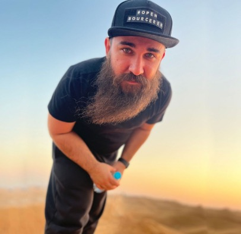
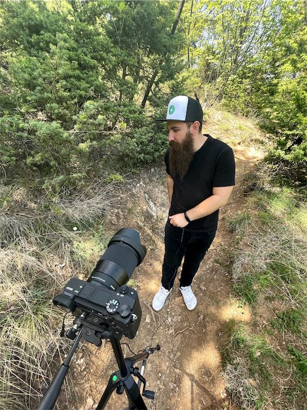
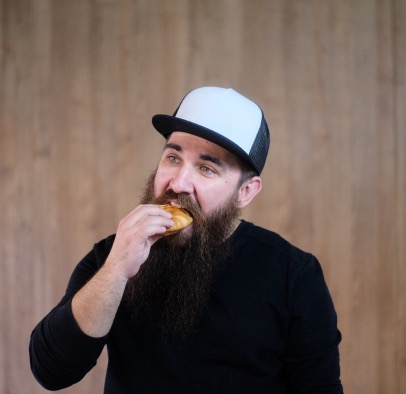

Hey, I'm Lazar Nikolov. I'm a developer advocate at
[Sentry](https://sentry.io/welcome). I live in Toronto, Canada, but originally
I'm from North Macedonia. As a fullstack engineer, I enjoy building interesting
pet projects from scratch. Of course, just like any normal developer I end up
abandoning them. I'm a super curious fellow and I'm always up to learn something
new. Aside from learning new things, I enjoy live streaming on YouTube and
creating courses for [egghead.io](https://egghead.io).

## Let me tell you a story

I was having a band practice one day back in high school (did I mention I played bass in a rock band?) and the drummer whips out a Google Nexus One. _**Whoah!**_ He said _"here, use this tuner app to tune your guitars"_. I was mind blown. First I thought what do HTC have in the music industry, but then the drummer explained to me that the app is not built by HTC, but by a random developer. _"Anyone can make apps"_, he said. And that was it. I was sold to the concept of programming. The thought that I can build something and thousand of people in this world can have it in their pockets was crazy.

So I started learning Java to build an app that would let me "cheat" on my graduation math exam. I called it Pocket Formulas. I didn't end up finishing the app in time, so I simply studied for the exam. I did finish it afterwards and published it on Google Play. 10k people downloaded it! That gave me a huge motivational boost to keep getting better at coding.

Fast forward to 2015. I get hired as an Android developer after giving a talk at a local conference after Peter Sunde from ThePirateBay. That's how I started my professional career. While I was working on an Android app for a client, I was learning iOS in the meantime. Eventually I'd take on an iOS project after convincing my manager that I can pull it off. It was fun working on those apps. I was working on an Android TV and Apple TV app similar to Netflix. I actually wasn't aware of Netflix's existence back then.

A year went by and I decided to move to a different company because my roommate and university friends were there. I was also the only mobile developer in the previous company and I needed a mentor. I was the 6th person in that company, and helped it grow to almost 70. During those 6 years I solidified my foundational knowledge and gained a lot of experience in both web and mobile development.

Around the middle of 2019 the idea of creating content for other dev folks really started to grow on me. I started a Hashnode blog and wrote a few articles. But I felt like I wanted to do more, so at the end of 2020 I started live streaming on Twitch. I was building an app with Blitz.js and Chakra UI. 2 months in and the creator of Chakra UI reached out to me if I wanted to join the core team. Damn right I did! At first I didn't know what my responsibilities were going to be, but it turns out that I was going to be a DevRel.

And that's how I got dragged into Developer Advocacy. I was doing DevRel for Chakra UI in my afterwork hours. I became really good friends with the Chakra UI team, had fun growing the framework with them, and even had a chance to see them in real life during our two meetups at Dubai.

DevRel started to grow on me day by day. I started day dreaming about it being my full time job instead of my hobby. Then in 2022 a recruiter shoots me an email. He told me he has seen my work and wanted to ask me if I'm interested to join a brand new DevRel team. Oh wow. After a lot thoughts put into it, and discussions with my wife, I decided to go for it. I passed the interviews, got the job, and moved to Canada with my wife and our cat.

And now we're here. That's the story for now.
