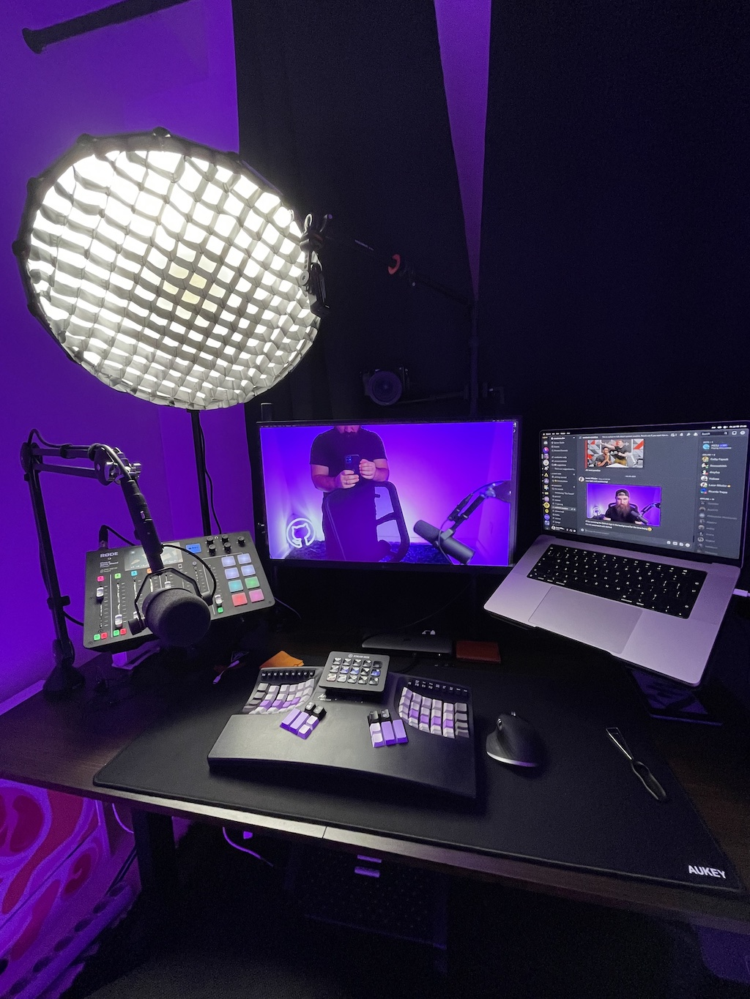

Folks have been asking on my live streams about what software or gear I use for
work.

Here you can find both the hardware and software I use. Things change often, but
I try my best to keep this list up to date. If I miss something out, or you
noticed that I have it but haven't added it to the list, tweet me
[@nikolovlazar](https://twitter.com) and I'll add it.

By the way, **most links are affiliate.** If you click and buy one of my gear, a
small ka-ching will happen in my bank account.

## Computing

- My main machine is a
  [16" 2021 MacBook Pro M1 Max](https://support.apple.com/kb/SP858?locale=en_US)
  with 32 GB RAM and 1 TB SSD. It's a beast. It can chew any bone you throw at
  it. I don't use a separate machine for live streaming. I stream and work on
  this machine at the same time.

- I use the [LG UltraFine 27UQ850-W](https://amzn.to/3H8tQxD) as an external
  monitor. It's a decent 4K monitor with Nano IPS display, matt panel so it
  doesn't reflect, and it delivers 90W through USB-C. I don't use that though. I
  connect it with my laptop through HDMI. It's not super huge on connectivity
  though. There aren't a lot of ports on it. But it gets the job done!

- I have both my laptop and monitoring mounted on an
  [ergonomic mounting system](https://ergonomics.mk/product/drzac-1-monitor-laptop-dm25l1x1/)
  that I got from back home. The website is in Macedonian, but you'll get the
  idea from the photos.

- The clacking noise comes from my
  [Kinesis Advantage](https://kinesis-ergo.com/support/advantage/). I've always
  wanted one. I got it second-hand from a fellow developer for 250 CAD. I was
  having wrist pain I couldnt't ignore, so I didn't need to try hard to convince
  myself that I need one more keyboard. I also have the
  [Keychron Q1 Version 2](https://amzn.to/3N5Xsj5). It's a hot swappable
  mechanical keyboard that's heavy as a chihuahua (hint: that's not a lot for a
  dog, but a lot for a keyboard). I have it equipped with
  [these Gateron G Pro Browns](https://amzn.to/3KU28pw). They say they're pre
  lubed. I wouldn't say they have done a good job, but it's not super bad. I
  don't see myself lubing switches in near future.

- On top of my Kinesis Advantage I've got my
  [Stream Deck](https://amzn.to/3PvD8c7). I've got it configured to switch
  between 3 profiles: Twitch Streaming, YouTube Streaming, and YouTube
  Recording. I'm able to switch my scenes, start and stop streaming or recording
  with a single button. Love this thing!
  

- For my mouse, something I use less and less, I picked the
  [Logitech MX Master 3s for Mac](https://amzn.to/40uHbqU). I've always wanted
  the MX Master, but I've been using Apple's Magic Mouse up until recently. I
  really like this mouse. It has a silent click. It has infinite scroll which is
  actually pretty useful. It's an overall good mouse.

- I have everything connected to my [Corsair TBT200](https://amzn.to/3q94cn6),
  which is a Thunderbolt 4 dock. It's a pretty good dock. It has a lot of ports.
  It delivers 96W of power to my laptop. It's something I have to have, since my
  MacBook only has 3 USB-C ports.

- For my lighting, I use the [Neewer CB150](https://amzn.to/3Qjmugf) with the
  [Aputure Light Dome Mini II](https://amzn.to/43P7t8S) softbox mounted on it.
  This is a really good, budget friendly option for studio lighting. The softbox
  comes with a honeycomb grid, which makes the light only illuminate me but not
  the background. It also has a gel mount if I want to add some color to the
  light, but I don't see that happening, at least for my key light.

  

## Audio

- My main microphone is [Shure SM7B](https://amzn.to/3H4Hr9p). I don't think
  I'll ever need a different dynamic microphone. It's a dynamic XLR microphone
  used by big names in the music industry like Michael Jackson and Metallica.

- I've got my microphone mounted on the [RØDE PSA1](https://amzn.to/43LYmqO).
  This is a good arm that feels premium and can support heavier microphones.

- Since the SM7B is a gain hungry microphone, I'm using the
  [Triton Audio FetHead](https://amzn.to/41An4ZN) to give it some gain without
  introducing a lot of noise in the sound. An alternative to this would be a
  Cloudlifter, but I like the Fethead because it's an inline preamp, meaning I
  don't need two XLR cables to have it connected between the microphone and the
  audio interface.

- The mic is connected to my [RØDECaster Pro](https://amzn.to/43LYmqO) with an
  XLR cable. This is an audio interface that converts the analog audio to
  digital. It's a podcasting machine, so it has a number of inputs on it. But it
  is pretty big. [I reviewed it](/blog/rodecaster-pro-review). It has all the
  audio effects you need so you don't need additional audio equipment like a
  compressor or noise gate or anything like that. I have this connected to my
  laptop via a USB-C cable.

- Since the audio interface is pretty big, I mounted it on my table on a
  [Vivo Laptop Stand](https://amzn.to/3V0bowM). It clears up a big portion of my
  desk and it also looks pretty cool. You can see a photo in my review blog I
  mentioned above.

- I also have the [RØDE NT-USB](https://amzn.to/43RALoK) and
  [Audio Technica ATR2100X](https://amzn.to/3N0ScNL) microphones. The RØDE was
  my first ever microphone so I used it when I started live streaming. I got the
  Audio Technica as a gift from [Egghead.io](https://egghead.io) when I joined
  their platrform as an instructor.

## Video

- I'm using the [Sony a6300](https://amzn.to/3oxKFM4) with the
  [Sigma 16mm f1.4](https://amzn.to/3H4Fytd). This combo is like an industry
  standard. I've seen lots of creators use the same combination and it's not for
  nothing. The camera shoots 6k and then it downscales it to 4k so you get
  crispier 4k that way. The lens is just phenomenal. It's a wide lens, so it's
  perfect for a battle station camera use case.

- I'm powering my camera with a
  [Subtel PW20 Power Adapter](https://www.subtel.de/en/Power-supply-for-Sony-Alpha-A6000-A6300-A6500-A5000-A5100-Alpha-7-A7-A7s-A7II-Sony-RX10-III-915664.html)
  This is a phantom battery adapter that allows you to power your camera through
  your wall sockets so you won't have to switch batteries in the middle of your
  live streaming.

- I've got the [Desview T3 Teleprompter](https://amzn.to/3mV9zot) mounted in
  front of my camera. Think what you want, but it's super convenient having a
  teleprompter. The time it takes to make the videos is cut down drastically.
  And if you've ever tried making videos, you know how important that is.

- The camera is mounted on an [Elgato Solid Arm](https://amzn.to/43TvcGo)
  clamped on an [Elgato Master Mount L](https://amzn.to/3Amo7AM). I've got a
  cheap right light on top of the Master mount.

- I'm connecting my camera to my computer using the
  [Elgato Camlink 4k](https://amzn.to/3H3rVul). This is an HDMI capture device
  that lets you use your mirrorless or DSLR as a webcam.

## Furniture

- I bought the [MotionGrey Ergo2 Standing Desk](https://amzn.to/3LofCeN) along
  with the [MotionGrey M Series Chair](https://amzn.to/3LjEnJ0) when I moved to
  Toronto. They were heavily discounted. I took the arm rests off the chair, and
  the extras like the headphone and drink holders from the desk. Honestly, I'm
  not using it in standind mode as much as I'm supposed to. These are good desk
  and chair though. When properly adjusted, you get no pain in your back or
  neck. And that's super important!

- To help me with the ergonomic adjustments I bough
  [this thingy for my feet](https://amzn.to/3LnN6K6). You'll never realize how
  much you need one until you actually get one. It plays a crucial role in my
  ergonomics setup. The massage parts aren't that good, so sometimes I avoid
  putting my feet on them. They're good for fidgeting though (with your feet).

## Software

- I use both [Visual Studio Code](https://code.visualstudio.com/) and
  [Neovim](https://neovim.io/) as editors. I use VSCode only when making coding
  tutorials, and Neovim for everything else.
  [Here's my nvim config](https://github.com/nikolovlazar/dotfiles) if you're
  interested.

- I use the [Dank Mono](https://philpl.gumroad.com/l/dank-mono) font in all my
  IDEs. I like how the italics look like. Such a fun font.

- In terms of terminals I use [Kitty](https://sw.kovidgoyal.net/kitty/). I'm
  using Kitty because it's super fast, and because I can make it fully minimal,
  without title bar and window controls. Neovim in Kitty is amazing. Again,
  check out my [Dotfiles repo](https://github.com/nikolovlazar/dotfiles) to see
  how I got everything configured.

- When designing I'm using [Figma](https://figma.com) and also
  [Sip](https://sipapp.io) for picking colors off the screen.

- I'm subscribed to SetApp, so I get a lot of apps for a flat monthly fee. If
  you'd like to try it out, you can use
  [my referral link](https://go.setapp.com/invite/lwyp5tic) so we both get a
  month free. The apps I use:

  - [Sip](https://sipapp.io) color color picking,
  - [Bartender](https://macbartender.com) for hiding menu items,
  - [CleanMyMac X](https://cleanmymac.com/) for system maintenance,
  - [CleanShot X](https://cleanshot.com) for screenshots and recording my
    screen,
  - [Squash](https://www.realmacsoftware.com/squash/) for compressing images for
    web,
  - and a lot more, but these are the ones I use on a regular basis.

- I use [Notion](https://notion.so) for note taking and project management as
  well. The database feature is perfect for keeping track of anything, like
  video ideas, blog posts, tasks for your job etc.

- I've replaced the Spotlight with [Raycast](https://raycast.com). It's much
  faster, has more features out of the box and it also has a number of
  extensions for even more capabilities. I do recommend you check it out.

- For video editing I use mainly
  [Premiere Pro](https://www.adobe.com/ca/products/premiere.html), but I still
  have
  [DaVinci Resolve](https://www.blackmagicdesign.com/products/davinciresolve/).

- Of course for live streaming I use [OBS Studio](https://obsproject.com/). I
  also use the [TDR Nova](https://www.tokyodawn.net/tdr-nova/) eq as an audio
  filter. I can do the audio fine tuning through my audio interface, but I
  haven't taken the time to really tune it according to my room and voice. The
  TDR Nova makes it simpler though.

- I also have [Screenflow](http://www.telestream.net/screenflow/overview.htm),
  which is a screen recording app that I got as a gift by egghead. It's a pretty
  cool recording app. It lets you record multiple audio and video sources, like
  you microphones, computer audio, screens, and cameras, in separate tracks so
  you can have more freedom of creativity when editing your videos afterwards.

- I use [Rogue Amoeba Loopback](https://rogueamoeba.com/loopback/) to loop the
  music to my audio interface and headphones at the same time while streaming so
  I can also listen to some music, not just you folks.
